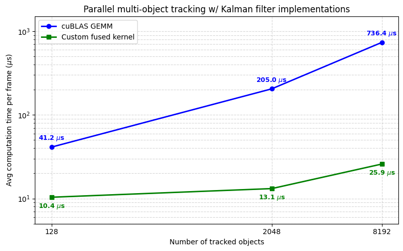

### About

This is a (heavily) work-in-progress Kalman filter multi-object tracking application parallelized with CUDA. The tracker uses a 2d constant-velocity motion model with white-noise motion noise and sensor noise; sensor data is simulated. I handwrote the Kalman-Filter predict-update fused CUDA kernel. By keeping data in registers and coalescing global mem access, we can extract significant performance benefits against the naive generalist cuBLAS implementation of matrix operations. 

### Results
Experimental observations from comparing to a naive cuBLAS batched GEMM implementation of parallelized Kalman filters:

### Immediate tasks
- Add sensor simulation code
- Async memcpy between device and host to speeed up data transfer

### Next tasks
- Data association w/ Munkres (hungarian) algorithm
- Gated prediction-observation matching w/ Mahalanobis distance metric
- Parallelized connected-components, integrating ^^ for fast gpu data association
